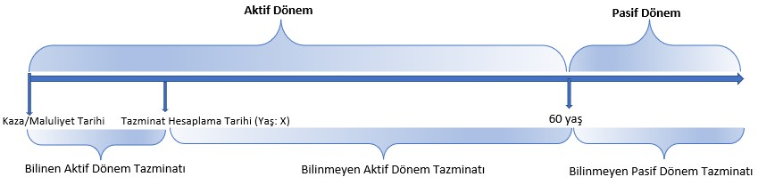

```{r setup, include=FALSE}
knitr::opts_chunk$set(
    echo = TRUE,
    eval = TRUE,
    message = FALSE,
    warning = FALSE,
    dpi = 300,
    fig.align = "center"
    )
```


```{r echo=FALSE, include=FALSE}


Sys.setlocale(locale = "Turkish")

```


```{r echo=FALSE}


  # Load Libraries & Files ----

library(readxl)
library(tidyr)
library(tidyverse)
library(lubridate)
library(stringr)
library(scales)
library(formattable)


  # Dosya Yükle ----
  
dosya_bilgiler <- read_excel("../ProInsure/data/dosya_bilgiler.xlsx", sheet = "Sayfa1")

# PR_TRH_2010 <- read_excel("../ProInsure/data/TRH2010_son.xlsx", sheet = "Sayfa1")

Asgari_Tablo <- read_excel("../ProInsure/data/Asgari_Ucret_Tablosu_rvz.xlsx", sheet = "Program")


Teminat_Limit_Tablosu <- read_excel("../ProInsure/data/Teminat_Limit_Tablosu_rvz.xlsx", sheet = "Teminat")


```


```{r echo=FALSE, include=FALSE}

  
  # Dosya Bilgileri ----
  
  dosya_no <- params$PDosya_No
  # dosya_no <- dosya_bilgiler$Dosya_No
  # dosya <- dosya_bilgiler %>% filter(Dosya_No == dosya_no)

  
  # Genel Bilgiler ----
  
  Teknik_Faiz <- 0
  pasif_donem_yas <- 60
  faiz_oranı <- 9
  
  # Kişisel Bilgiler ----

  Ad_Soyad <- params$PAd_Soyad
  Cinsiyet <- params$PCinsiyet
  Dogum_Tarihi <- as.Date(params$PDogum_Tarihi)
  Gelir_Durumu <- params$PGelir
  # Gelir_Durumu <- "Bekar"
  Kaza_Tarihi <- as.Date(params$PKaza_Tarihi)
  Maluliyet_Oranı <- params$PMaluliyet_Orani
  Kusur_Oranı <- params$PKusur_Orani
  Gecici_Maluliyet_sure <- params$PGecici_Maluliyet_Sure
  Kısmi_Odeme_Sayısı <- params$PKismi_Odeme_Sayisi
  Kısmi_Odeme_Tarihi_1 <- as.Date(params$PKismi_Odeme_Tarihi_1)
  Kısmi_Odeme_Tutarı_1 <- params$PKismi_Odeme_Tutari_1
  # Kısmi_Odeme_Tarihi_2 <- as.Date(params$PKısmi_Odeme_Tarihi_2)
  # Kısmi_Odeme_Tutarı_2 <- params$PKısmi_Odeme_Tutarı_2
  Yasam_Tablosu <- params$PYasam_Tablosu
  # Bakıcı_gideri <- params$PBakici
  # Bakıcı_gideri_suresi <- params$PBakici_Sure
  #
  

  # Kişisel Bilgiler ----

# Ad_Soyad <- dosya_bilgiler$Ad_Soyad
# Cinsiyet <- dosya_bilgiler$Cinsiyet
# Dogum_Tarihi <- as.Date(dosya_bilgiler$Dogum_Tarihi)
# Gelir_Durumu <- dosya_bilgiler$Gelir
# Kaza_Tarihi <- as.Date(dosya_bilgiler$Kaza_Tarihi)
# Maluliyet_Oranı <- dosya_bilgiler$Maluliyet_Orani
# Kusur_Oranı <- dosya_bilgiler$Kusur_Orani
# Gecici_Maluliyet_sure <- dosya_bilgiler$Gecici_Maluliyet_sure
# Kısmi_Odeme_Sayısı <- dosya_bilgiler$Kısmi_Odeme_Sayısı
# Kısmi_Odeme_Tarihi_1 <- as.Date(dosya_bilgiler$Kısmi_Odeme_Tarihi_1)
# Kısmi_Odeme_Tutarı_1 <- dosya_bilgiler$Kısmi_Odeme_Tutarı_1
# Kısmi_Odeme_Tarihi_2 <- as.Date(dosya_bilgiler$Kısmi_Odeme_Tarihi_2)
# Kısmi_Odeme_Tutarı_2 <- dosya_bilgiler$Kısmi_Odeme_Tutarı_2
# Yasam_Tablosu <- "TRH_2010"


  
  # Manuel Gelir Tablosu ----
  
  gelir_tablosu <- 
    
    tibble::tribble(
      ~Donem, ~Gelir,
      
      "2005-01-01/2005-12-31", 100L,
      "2006-01-01/2006-12-31", 100L,
      "2007-01-01/2007-06-30", 100L,
      "2007-07-01/2007-12-31", 100L,
      "2008-01-01/2008-06-30", 100L,
      "2008-07-01/2008-12-31", 100L,
      "2009-01-01/2009-06-30", 100L,
      "2009-07-01/2009-12-31", 100L,
      "2010-01-01/2010-06-30", 100L,
      "2010-07-01/2010-12-31", 100L,
      "2011-01-01/2011-06-30", 100L,
      "2011-07-01/2011-12-31", 100L,
      "2012-01-01/2012-06-30", 100L,
      "2012-07-01/2012-12-31", 100L,
      "2013-01-01/2013-06-30", 100L,
      "2013-07-01/2013-12-31", 100L,
      "2014-01-01/2014-06-30", 100L,
      "2014-07-01/2014-12-31", 100L,
      "2015-01-01/2015-06-30", 100L,
      "2015-07-01/2015-12-31", 100L,
      "2016-01-01/2016-12-31", 100L,
      "2017-01-01/2017-12-31", 100L,
      "2018-01-01/2018-12-31", 100L,
      "2019-01-01/2019-12-31", 100L,
      "2020-01-01/2020-12-31", 100L,
      "2021-01-01/2021-12-31", 100L,
      "2022-01-01/2022-06-30", 100L,
      "2022-07-01/2022-12-31", 100L,
      "2023-01-01/2023-06-30", 100L,
      "2023-07-01/2023-12-31", 100L,
      "2024-01-01/2024-12-31", 100L,
      
    )
  
  
  gelir_tablosu <- gelir_tablosu %>% 
    mutate(Gelir = as.numeric(Gelir))
  
  # Genel Gelir Tablosu ----
  
  Gelir_tablo <-  Asgari_Tablo %>%
    left_join(gelir_tablosu) %>%
    separate(Donem, sep = "/", into = c("Donem_Baslangic", "Donem_Son")) %>%
    mutate(D_B = as.Date(Donem_Baslangic),
           D_S = as.Date(Donem_Son))
  

    # Kaza Tarihi Teminat Limiti
  
  
  Teminat_Limit_Tablosu <- Teminat_Limit_Tablosu %>% 
    separate(Donem, sep = "/", into = c("Donem_Baslangic", "Donem_Son")) %>%
    mutate(D_B = as.Date(Donem_Baslangic),
         D_S = as.Date(Donem_Son))
  
  kaza_tarihi_teminat <- Teminat_Limit_Tablosu %>% 
    filter(D_S >= Kaza_Tarihi & Kaza_Tarihi > D_B)
  
  kaza_tarihi_teminat_limiti <- as.numeric(format(kaza_tarihi_teminat$Teminat_Limiti, scientific = FALSE)) 

  
```


```{r echo=FALSE, include=FALSE}

  # 1-  YAS HESAPLAMALARI ----
  
  Hesap_Tarihi <- Sys.Date()
  Hesap_Tarihi_Sirket <- Kısmi_Odeme_Tarihi_1
  
  kaza_tarihi_yas <- round(lubridate::time_length(difftime(Kaza_Tarihi, Dogum_Tarihi), "year"))  
  hesap_tarihi_yas <- round(lubridate::time_length(difftime(Hesap_Tarihi, Dogum_Tarihi), "year")) 
  
  sirket_odeme_tarihi_yas <- round(lubridate::time_length(difftime(Hesap_Tarihi_Sirket, Dogum_Tarihi), "year")) 

```


```{r echo=FALSE, include=FALSE}


  # 2- HESAPLAMADA KULLANILACAK TRH TABLOSU ----
  
  ## 2.1 Hesaplama Tarihine göre beklenen ömür ----


PR_TRH_2010 <- if ( Yasam_Tablosu == "TRH-2010") {
  read_excel("../ProInsure/data/All_Tables.xlsx", sheet = "TRH-2010")
} else if ( Yasam_Tablosu == "TUIK_20-22") {
  read_excel("../ProInsure/data/All_Tables.xlsx", sheet = "TUIK_20-22")
} else if ( Yasam_Tablosu == "TUIK_19-21") {
  read_excel("../ProInsure/data/All_Tables.xlsx", sheet = "TUIK_19-21")
} else if ( Yasam_Tablosu == "TUIK_18-20") {
  read_excel("../ProInsure/data/All_Tables.xlsx", sheet = "TUIK_18-20")
} else {
  read_excel("../ProInsure/data/All_Tables.xlsx", sheet = "PMF-19312")
}

  
  erkek_table <- PR_TRH_2010 %>% 
    select(Yas, Erkek)
  
  kadın_table <- PR_TRH_2010 %>% 
    select(Yas, Kadın) 
  
  
  hesaplama_tarihi_PR_TRH <- if (Cinsiyet == "Erkek") {
    filtered_PR_TRH <- erkek_table %>% 
      filter(Yas == hesap_tarihi_yas) %>% 
      select(Erkek)
  } else {
    filtered_PR_TRH <- kadın_table %>% 
      filter(Yas == hesap_tarihi_yas) %>% 
      select(Kadın)
  }
  
  
  hesaplama_tarihi_beklenen_omur <- ifelse(Cinsiyet == "Erkek", hesaplama_tarihi_PR_TRH$Erkek, hesaplama_tarihi_PR_TRH$Kadın)
  hesaplama_tarihi_beklenen_omur <- round(hesaplama_tarihi_beklenen_omur,digits = 2)
  
  
  ## 2.3 Pasif Dönem Yas- TRH Tablosu ----
  
  hesaplama_tarihi_PR_TRH_pasif <- 
    if (Cinsiyet == "Erkek") {
      erkek_table %>% 
        filter(Yas == pasif_donem_yas)
    } else {
      kadın_table %>% 
        filter(Yas == pasif_donem_yas)
    }
  
  
  hesap_tarihi_pasif_beklenen_omur <- ifelse(Cinsiyet == "Erkek", hesaplama_tarihi_PR_TRH_pasif$Erkek, hesaplama_tarihi_PR_TRH_pasif$Kadın)
  hesap_tarihi_pasif_beklenen_omur <- round(hesap_tarihi_pasif_beklenen_omur,digits = 2)
  

```


```{r echo=FALSE, include=FALSE}

  # 3- PARAMATRE TABLOSU ----
  
  
  parametre_tablosu <- data.frame(PARAMETRE = c("Dosya_No", "Ad-Soyad", "Kaza Tarihi Yas", "Hesap Tarihi Yas", "Cinsiyet", "Kaza Tarihi", "Maluliyet Oranı", "Teknik Faiz", "Yaşam Tablosu", "Kusur Oranı", "Geçici İş Göremezlik Süresi (ay)"),
                                  DEĞER = c(dosya_no, Ad_Soyad, kaza_tarihi_yas, hesap_tarihi_yas, Cinsiyet, as.character(Kaza_Tarihi), 
                                            Maluliyet_Oranı, Teknik_Faiz, Yasam_Tablosu, Kusur_Oranı, Gecici_Maluliyet_sure)
                                  )
  
  parametre_tablosu <- parametre_tablosu %>% filter(DEĞER != "none")
  
  parametre_tablosu2 <- tibble(
    "Dosya_No" = dosya_no,
    "Ad-Soyad" = Ad_Soyad,
    "Yas" = kaza_tarihi_yas,
    "Hesap Tarihi Yas" = hesap_tarihi_yas,
    "Cinsiyet" = Cinsiyet, 
    "Kaza Tarihi" = as.character(Kaza_Tarihi),
    "Maluliyet Oranı" = Maluliyet_Oranı,
    "Teknik Faiz" = Teknik_Faiz,
    "Yaşam Tablosu" = Yasam_Tablosu,
    "Kusur Oranı" = Kusur_Oranı,
    "Geçici İş Göremezlik Süresi (ay)" = Gecici_Maluliyet_sure

  )


```


```{r echo=FALSE, include=FALSE}

  
  # 5- HESAP TARİHİ İLE HESAPLAMA (AKTÜERYAL HESAPLAMA) ----
  
  ## 5.1 Hesap tarihi Bilinen Dönem Hesaplaması ----
  
  ### 5.1.1 Hesap tarihi Tam Maluliyet Donemi Tablosu ----
  
  
  maluliyet_tarihi_baslangıc <- Kaza_Tarihi
  maluliyet_tarihi_bitis <- (maluliyet_tarihi_baslangıc) + (Gecici_Maluliyet_sure * 30)
  
  HT_Maluliyet_Donemi_tablosu <- Gelir_tablo %>% 
    filter(D_S >= maluliyet_tarihi_baslangıc & maluliyet_tarihi_bitis > D_B)
  
  HT_Maluliyet_Donemi_tablosu$Donem_Baslangic[1] <- as.character(maluliyet_tarihi_baslangıc)
  HT_Maluliyet_Donemi_tablosu$Donem_Son[nrow(HT_Maluliyet_Donemi_tablosu)] <- as.character(maluliyet_tarihi_bitis)
  
  HT_Maluliyet_Donemi_tazminat_hesaplama <- HT_Maluliyet_Donemi_tablosu %>% 
    mutate(Donem_Baslangici = as.Date(Donem_Baslangic),
           Donem_Sonu = as.Date(Donem_Son)) %>% 
     mutate(Kazanilan_Ay = round(as.numeric(difftime(as.Date(Donem_Sonu), as.Date(Donem_Baslangici), units = "days")) / 30, 2)) %>%
    
    # mutate(Kazanilan_Ay = round(time_length(as.Date(Donem_Sonu) - as.Date(Donem_Baslangici), "month") , digits = 1)) %>%
    # 
    mutate(Kazanilan_Ay = case_when(
      Kazanilan_Ay >= 11.96 ~ plyr::round_any(Kazanilan_Ay, 1),
      Kazanilan_Ay > 6.1 ~  plyr::round_any(Kazanilan_Ay, 0.1),
      Kazanilan_Ay >= 5.9 ~  plyr::round_any(Kazanilan_Ay, 1),
      # Kazanilan_Ay >= 4.6 ~ plyr::round_any(Kazanilan_Ay, 0.1),
      # Kazanilan_Ay <= 2 ~ plyr::round_any(Kazanilan_Ay, 0.1),
      TRUE ~ Kazanilan_Ay)) %>%
    
    mutate(Maluliyet_Oranı = 100) %>% 
    mutate(Kusur_Oranı = Kusur_Oranı) %>% 
    select(Gelir_Durumu, Kazanilan_Ay, Donem_Baslangic, Donem_Son, Maluliyet_Oranı, Kusur_Oranı) %>% 
    rename("Gelir" = Gelir_Durumu) %>% 
    mutate(Donem_Baslangic = format(as.Date(Donem_Baslangic), "%d/%m/%Y"),
           Donem_Son = format(as.Date(Donem_Son), "%d/%m/%Y")) %>% 
    mutate(Donem_Tazminat = round(Kazanilan_Ay * Gelir * Maluliyet_Oranı/100 * Kusur_Oranı/100, digits = 2)) 
  
  HT_Tam_Maluliyet_Donemi_Tablosu <- HT_Maluliyet_Donemi_tazminat_hesaplama  %>% 
    select(Donem_Baslangic, Donem_Son, Kazanilan_Ay, Gelir, Maluliyet_Oranı, Kusur_Oranı, Donem_Tazminat)
  
  
 
  
```


## GENEL BİLGİLER

Sayın Hakemliğinizce tarafımıza iletilen dosya kapsamında geçici iş göremezlik tazminatı, sürekli maluliyet tazminatı ve geçici bakıcı gideri tazminatı hesaplaması Bilirkişiliğimiz teknik bilgisi kapsamında hesaplanmıştır. 

Dosya kapsamında elde edilen bilgiler kapsamında yapılan hesaplamaya ilişkin tüm bilgiler ve aktüeryal hesaplama parametreleri, formülleri ve hesaplama prensipleri ile malul için hesaplanan tazminat tutarına ilişkin bilgiler açık ve anlaşılabilir olacak şekilde ilerleyen bölümlerde detaylandırılmaktadır.

## HESAPLAMA PRENSİPLERİ

Aktüeryal olarak maluliyet tazminatı hesaplaması, mevzuata uygun olarak temin edilecek maluliyet oranına sahip kişinin kaza tarihinden itibaren muhtemel yaşam süresi boyunca elde edeceği gelirden kaza nedeniyle ne kadar tutarda mağdur kalacağının tahminini içermektedir.

Söz konusu tahmin yapılırken temel olarak iki bölümde hesaplama yapılmaktadır;

**Bilinen dönem hesaplaması:** Malulün kaza tarihinden itibaren bilirkişi raporunun hazırlandığı tarihe kadar olan bölümde (bilinen dönem hesaplaması) sahip olduğu bilinen geliri, kazada kusuru (kusur oranı), kaza sonucu oluşan maluliyet oranı dikkate alınarak bilinen dönem tazminatı herhangi bir aktüeryal tahmin yapılmadan hesaplanır. Bilinen dönemde yaşam ihtimalini içeren aktüeryal herhangi bir hesaplama yapılmamasının temel nedeni bu bölümde kişinin zaten yaşıyor olduğunun bilinmesidir.

Bilinen dönem geliri, dosya kapsamında beyan edilen aynı yıla ait bordrolardan temin edilmektedir. Bu bordrolardan elde edilen gelirin yıllar itibariyle her yıla ait aylık ortalaması alınarak yıllık geliri üzerinden hesaplama yapılmaktadır. Şayet düzenli bir bordro olmaması durumunda bordrodaki tutar asgari ücrete oranlanır, bu oran asgari ücret üzerinden diğer dönemlere de yansıtılarak hesaplama yapılır. Eğer dosya kapsamında herhangi bir bordro görülememiş ise asgari ücret üzerinden hesaplaama yapılır.

**Bilinmeyen dönem hesaplaması:** Bu kısım bilirkişi raporunun hazırlandığı tarihten itibaren malulün muhtemel yaşam süresi boyunca yapılacak hesaplamayı içermektedir. Malul, bu dönemde belli bir yaşa kadar aktif olarak çalışacağı (aktif dönem), belirli bir yaştan itibaren ise emekli olarak pasif dönemde kalacağı (pasif dönem) şeklinde iki bölüme ayrılmaktadır. Yargıtay kararları ve bu alandaki artık kabul edilmiş pasif yaş başlangıcı olan 65 yaşa kadar malulün aktif dönemde elde edeceği gelir kullanılırken, pasif dönemde ise bu konuda yerleşik içtihatler dikkate alındığında AGİ hariç net asgari ücret kullanılmaktadır. 

Bilinmeyen dönem hesaplaması kişinin yaşam ihtimalinin belirli bir gelir ile elde edeceği, bu gelir (aktif ve pasif dönem ayrı ayrı) üzerinden kazadaki kusur oranı ile bu dönemde daimi maluliyet oranın çarpılması sonucu hesaplanmaktadır.

Kişinin bilinmeyen dönemde hangi yaşam ihtimaline sahip olduğu hususu temel olarak aktüerya alanını ilgilendirmektedir. Bu konuda en sağlıklı, yansız ve tarafsız bilgi ancak yaşam tablolarından elde edilebilmektedir. Hesaplamalarda kullanılan Yaşam Tabloları genel olarak TRH 2010 Kadın ve Erkek, PMF tablolarıdır. Bu tabloların dışında da yaşam tablolarının bulunduğunu belirtmekte fayda bulunmaktadır, ancak Yargıtay kararları dikkate alındığında yaşam tablosu PMF kullanılırken, sigortacılık mevzuatı kapsamında ise TRH 2010 kullanılmaktadır. Her iki tablodan elde edilecek tazminat tutarı yaşam ihtimallerinin farklı olmasından dolayı haliyle farklı çıkabilmektedir.

Bununla birlikte, yaşam tablolarına ilaveten, ilerde malulün elde edeceği gelirin bugünkü değerinin hesaplanmasında **teknik faiz** kavramı kullanılmaktadır. Teknik faiz PMF yaşam tablosunun kullanıldığı hesaplamalarda “0” (sıfır) olarak kullanılırken, sigortacılık mevzuatında ise TRH 2010 tablosu ile birlikte teknik faiz %1,8 olarak kullanılmaktadır. 


TRH Yaşam tablosu ile teknik faizin birlikte kullanıldığı malulün gelecekteki gelir akışlarının (iratların) yaşam boyu yaşama ihtimalleri ile ağırlıklandırılmış bugünkü değerini içeren aktüeryal annüite faktörü hesaplaması ve dönemlere ilişkin yapılacak tazminat hesaplamalarının detayları aşağıda verilmektedir:  

  Bilinmeyen Aktif Dönem Tazminatı Annüite Faktörü (AAF)= [N(X)-N(60)]/D(X)
  
  Bilinmeyen Aktif Dönem Tazminatı = AAF * Bilinen En Son Yıllık Gelir * Kusur Oranı * Maluliyet Oranı

  Bilinmeyen Pasif Dönem Tazminatı Annüite Faktörü (PAF)= N(60)/D(60)
  
  Bilinmeyen Aktif Dönem Tazminatı = PAF * Pasif Dönem Yıllık Gelir (AGİ hariç net asgari ücret) * Kusur  Oranı * Maluliyet Oranı
                 
  TRH yaşam tablosu ve teknik faiz kullanılarak yapılan aktüeryal hesaplamada kullanılan N ve D değerleri teknik faiz ile indirgenmiş yaşam tablosundan elde edilmektedir.

Yaşam tablosu ile %0 teknik faiz kullanılarak yapılan progresif rant hesaplama yönteminde ise teknik faiz “0” (sıfır) olduğu için annüite faktörü doğrudan kişinin hesaplama tarihindeki yaşı temel alınarak yaşam tablosundan elde edilen beklenen ömre (E) eşit olmaktadır. Bu yöntemle yapılan hesaplama adımları ve tazminat hesaplaması detayı aşağıdaki gibidir:

  Bilinmeyen Aktif Dönem Tazminatı = (60-X) * Bilinen En Son Yıllık Gelir * Kusur Oranı * Maluliyet Oranı
  
  Bilinmeyen Pasif Dönem Tazminatı Annüite Faktörü = (X+E-60) * Pasif Dönem Yıllık Gelir (AGİ hariç net asgari ücret) * Kusur Oranı * Maluliyet Oranı

  *X değeri kişinin bilirkişi hesaplama tarihindeki bilinmeyen dönem başlangıcındaki yaşıdır.   

Bakiye maluliyet tazminatı hesaplamasında; daha önce malule sigorta şirketi tarafından kaza sonucu bir veya birden fazla ödeme yapıldı ise, söz konusu ödeme tutarı veya tutarları %9 yasal faiz ile bilirkişi raporu tarihine çekilerek rapor tarihli değerleri elde edilir; daha sonra, bu tutar hesaplanan aktüeryal tazminat toplamından düşülerek malule ödenecek bakiyet maluliyet tazminat tutarı bulunur. Ayrıca, şirket tarafından bir ödeme yapıldı ise öncelikle şirket ödeme tarihi itibariyle hesaplama yapılır, şayet şirket ödemesi ile yapılan hesap farklı çıkar ise bu durumda bilirkişi rapor tarihi itibariyle tekrar hesap yapılır. 
\

## DOSYA KAPSAMINDA ELDE EDİLEN PARAMETRİK VERİLER

Tazminat hesabında kullanılacak parametrelerin değerleri bilirkişiliğimize iletilen dosya kapsamında taranmış ve detaylı olarak her bir parametre değeri aşağıdaki tabloda verilmektedir.


```{r echo=FALSE}

knitr::kable(parametre_tablosu, caption = "HESAPLAMA PARAMETRELERİ")


```


## AKTÜERYAL HESAPLAMA

### Bilinen Dönem Hesaplaması:
Kaza tarihinden geçici iş göremezlik süresi ve hemen akabinde sürekli maluliyet başlangıcı ile bilirkişi hesaplama tarihi arasındaki sürede malulün yıllar itibariyle gelir bilgisi, maluliyet oranı, şirket kusur oranı kullanılarak yapılan Bilinen Dönem tazminat tutarları aşağıdaki tabloda yıl bazında detaylı olarak verilmektedir.


```{r echo=FALSE}

knitr::kable(HT_Tam_Maluliyet_Donemi_Tablosu, caption = "Hesap Tarihi - Geçici Maluliyet Tablosu")

gecici_donem_tazminat <- sum(HT_Tam_Maluliyet_Donemi_Tablosu$Donem_Tazminat)


str_glue("{Gecici_Maluliyet_sure} aylık Geçici İş Göremezlik Tazminatı {gecici_donem_tazminat} TL olarak hesaplanmıştır.")


```


## SONUÇ


```{r echo=FALSE}

str_glue("Bilirkişiliğimize iletilen dosya kapsamında yapılan inceleme neticesinde elde edilen hesaplama parametreleri kapsamında gerçekleşen kazada malul kalan {Ad_Soyad} için hesaplanan geçici iş göremezlik tazminatı bilirkişi hesap tarihi itibariyle aşağıda belirtilmiştir;")

```


```{r echo=FALSE}


str_glue("* {Gecici_Maluliyet_sure} aylık Geçici İş Göremezlik Tazminatı {gecici_donem_tazminat} TL olarak hesaplanmıştır.")

```


Arz ederim.


**Bilirkişi: Erdener USTA (Lisanslı Aktüer-Sicil No: 132)**

